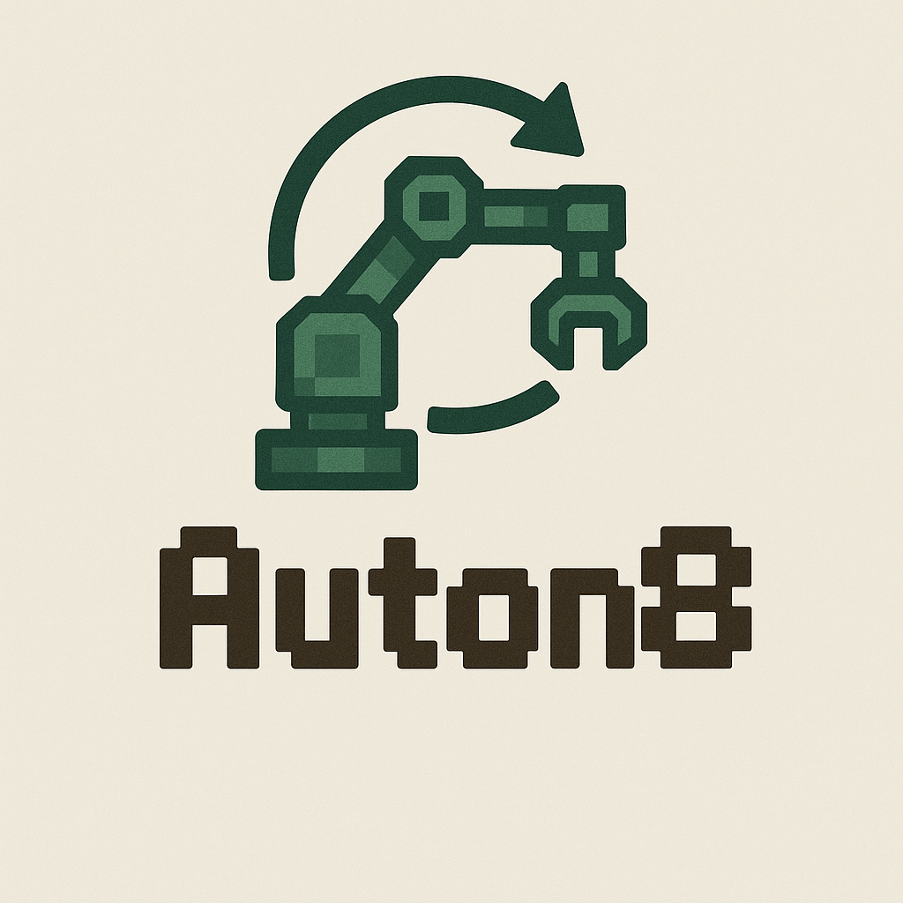

<table align="center" width="100%">
  <tr>
    <td align="center" width="130" style="min-width:130px;">
      
    </td>
    <td>

### Auton8
#### Minecraft Automation with n8n and Minescript API

This project lets you automate Minecraft gameplay using n8n workflows that communicate with a Fabric client mod. The mod integrates with Baritone for pathfinding and uses Meteor Client as its module framework.

The system has evolved from the original MQTT-based approach to use the Minescript API for more reliable communication between n8n and Minecraft. Docker containers are automatically managed to make setup easier.

**Attribution:**
- Original concept and base implementation: **KiLAB Gaming**
- AI-assisted refactoring and extensions: **Claude (Anthropic)**
- Current maintainer: **777April**

This is an educational proof-of-concept project.

    </td>
  </tr>
</table>

## Architecture

The system uses a bridge-based architecture where the core coordinates different specialized components:

- **MinescriptClient**: Handles HTTP communication with n8n through the Minescript API
- **DockerManager**: Automatically starts and manages n8n Docker containers
- **BaritoneBridge**: Controls pathfinding with plan execution and retry logic
- **ChatBridge**: Manages chat integration with message deduplication
- **TelemetryBridge**: Monitors player position, health, and world state
- **ConnectionBridge**: Handles session management and connection tracking
- **HudBridge**: Displays status information in the game HUD

## Meteor Client Modules

The mod includes several Meteor Client modules for different aspects of automation:

### MinescriptLink Module
- Main connection module that bridges Minecraft events to n8n
- Live configuration options (no restart required):
  - Chat receive/send toggle
  - Telemetry publishing
  - Baritone command acceptance
  - Telemetry interval adjustment (250ms to 15s)
- Session management with UUID-based session IDs
- Auto-reconnection handling

### Authentication Config Module
- Central configuration for all connection settings
- Organized into Connection, Authentication, Endpoints, and Docker groups
- Features:
  - Connection testing
  - Auth key generation
  - JSON credential export (pretty and compact formats)
  - Clipboard integration for easy n8n setup
  - File export for credential backup

### OpenWeb Module
- Opens web interfaces in your default browser
- Quick access to n8n dashboard and other web tools
- Configurable URLs for different environments

### Timelapse Module
- Captures screenshots at regular intervals
- Useful for documenting automated builds or farming
- Configurable timing and file naming

## 📦 Docker Installation

### Windows
1. Download Docker Desktop from: https://docs.docker.com/desktop/setup/install/windows-install/
2. Run the installer and follow the setup wizard
3. Restart your computer when prompted
4. Launch Docker Desktop and complete the initial setup

### macOS
1. Download Docker Desktop from: https://docs.docker.com/desktop/setup/install/mac-install/
2. Drag Docker.app to your Applications folder
3. Launch Docker from Applications
4. Follow the setup wizard and grant necessary permissions

### Linux

#### Debian/Ubuntu
```bash
# Update package index
sudo apt update

# Install required packages
sudo apt install apt-transport-https ca-certificates curl gnupg lsb-release

# Add Docker's official GPG key
curl -fsSL https://download.docker.com/linux/debian/gpg | sudo gpg --dearmor -o /usr/share/keyrings/docker-archive-keyring.gpg

# Add Docker repository
echo "deb [arch=$(dpkg --print-architecture) signed-by=/usr/share/keyrings/docker-archive-keyring.gpg] https://download.docker.com/linux/debian $(lsb_release -cs) stable" | sudo tee /etc/apt/sources.list.d/docker.list > /dev/null

# Install Docker
sudo apt update
sudo apt install docker-ce docker-ce-cli containerd.io docker-compose-plugin

# Add user to docker group (optional, avoids using sudo)
sudo usermod -aG docker $USER

# Start Docker service
sudo systemctl enable docker
sudo systemctl start docker
```

#### Fedora/RHEL/CentOS
```bash
# Install required packages
sudo dnf install dnf-plugins-core

# Add Docker repository
sudo dnf config-manager --add-repo https://download.docker.com/linux/fedora/docker-ce.repo

# Install Docker
sudo dnf install docker-ce docker-ce-cli containerd.io docker-compose-plugin

# Add user to docker group (optional)
sudo usermod -aG docker $USER

# Start Docker service
sudo systemctl enable docker
sudo systemctl start docker
```

#### Arch Linux
```bash
# Install Docker
sudo pacman -S docker docker-compose

# Add user to docker group (optional)
sudo usermod -aG docker $USER

# Start Docker service
sudo systemctl enable docker
sudo systemctl start docker
```

**Note:** After adding yourself to the docker group, log out and back in for the changes to take effect.

## 🚀 Quick Start

### 1) Install Required Mods (Minecraft 1.21.8)
Place these files in your Minecraft **mods** folder:
> ⚠️ This version targets **Minecraft 1.21.8** specifically.

**Required Downloads:**
- **Meteor Client** (latest for 1.21.8): https://meteorclient.com/download
- **Baritone** (place in `libs/` folder): https://github.com/cabaletta/baritone/releases
- **Fabric API** (for 1.21.8): https://modrinth.com/mod/fabric-api
- **Mod Menu** (for 1.21.8): https://modrinth.com/mod/modmenu
- **Auton8** mod JAR (build with `./gradlew build`)

### 2) Build the Project
```bash
# Build the Minecraft mod
./gradlew build

# Build n8n community nodes (optional)
cd n8n-minecraft-nodes
npm install
npm run build
```

### 3) Start Docker Services
**Automatic (Recommended):** The mod auto-manages n8n Docker containers

**Manual:**
```bash
# Windows
run-docker.bat

# Linux/macOS
./run-docker.sh

# Or using docker-compose directly
docker-compose up -d
```

Services will be available at:
- **n8n**: http://localhost:5678
- **Minescript API**: http://localhost:5679

### 4) Configure n8n
1. Visit http://localhost:5678
2. Create your n8n account
3. Import example workflows from `n8n-minecraft-nodes/examples/workflows/`
4. Configure Minescript API credentials in n8n nodes

### 5) Launch Minecraft
1. Start Minecraft with Fabric 1.21.8
2. Open Meteor Client GUI (Right-Shift by default)
3. Navigate to Auton8 modules and configure as needed
4. The mod will auto-start n8n containers and establish API connection

## 🔧 Development Commands

```bash
# Build the mod
./gradlew build

# Run in development
./gradlew runClient

# Clean build
./gradlew clean build

# View Docker logs
docker-compose logs -f

# Stop services
./stop-docker.sh  # or stop-docker.bat on Windows
docker-compose down
```

## 📡 API Integration

The system now uses **Minescript API** instead of MQTT:

### Default Configuration (Hard-coded in current build)
```java
// Minescript API endpoints
Base URL: "http://127.0.0.1:5679/api"
Client ID: "kilab-pc1"
Auth Key: "your-super-strong-auth-key"

// API Endpoints
Command: "/cmd"      // Receives automation commands
Events: "/events"    // Publishes game events
HUD: "/hud"          // HUD-specific updates
Baritone: "/baritone_state"  // Pathfinding state
```

### Session Management
The system uses **UUID-based session IDs** to prevent stale command processing:
- New session generated on each module activation
- All API messages include session correlation
- HTTP-based connection monitoring with auto-reconnection

## 🎯 n8n Community Nodes

This project includes comprehensive **n8n community nodes** for Minecraft automation:

### Available Nodes
- **Baritone Pathfinder**: Advanced pathfinding and navigation
- **Baritone Builder**: Automated building and construction
- **Minescript Command**: Execute Minecraft commands
- **Minescript Chat**: Bidirectional chat integration
- **Meteor Module**: Control Meteor Client modules
- **Minecraft Session**: Session and event management
- **Minecraft Telemetry**: Player and world monitoring

### Installation (Manual)
If not using auto-managed containers:
```bash
cd n8n-minecraft-nodes
npm install
npm run build
# Link to your n8n installation
```

## 🐛 Troubleshooting

### Common Issues

**Docker containers not starting:**
- Ensure Docker is running
- Check port availability (5678, 5679)
- View logs: `docker-compose logs`

**Minecraft mod not connecting:**
- Verify Minescript API is accessible at localhost:5679
- Check Minecraft logs for connection errors
- Ensure firewall allows local connections

**n8n workflows not triggering:**
- Verify Minescript API credentials in n8n nodes
- Check session ID correlation
- Monitor API endpoints for activity

### Debug Commands
```bash
# Check Docker containers
docker ps

# View n8n logs
docker-compose logs n8n

# Test API connectivity
curl http://localhost:5679/api/status

# Check Minecraft mod logs
# Located in .minecraft/logs/latest.log
```

## 📁 Project Structure
```
auton8/
├── src/main/java/com/april777/auton8/
│   ├── bridges/          # Bridge implementations
│   ├── core/            # Core system management
│   ├── docker/          # Docker container management
│   ├── minescript/      # Minescript API communication
│   └── modules/         # Meteor client modules
├── n8n-minecraft-nodes/ # n8n community nodes
│   ├── nodes/           # Node implementations
│   ├── credentials/     # API credentials
│   └── examples/        # Example workflows
├── docker-compose.yml   # Docker services configuration
└── WARP.md             # Development guide
```

## 🤝 Contributing

This is an educational proof-of-concept project. Contributions are welcome for:
- Bug fixes and stability improvements
- Additional n8n nodes
- Documentation enhancements
- Example workflows

## 📄 License

This project maintains the original license from KiLAB Gaming. See LICENSE file for details.

## 🙏 Acknowledgments

- **KiLAB Gaming**: Original Auton8 concept and implementation
- **Meteor Client**: Module framework and integration
- **Baritone**: Advanced pathfinding capabilities
- **n8n**: Workflow automation platform
- **Claude (Anthropic)**: AI assistance in refactoring and extensions
